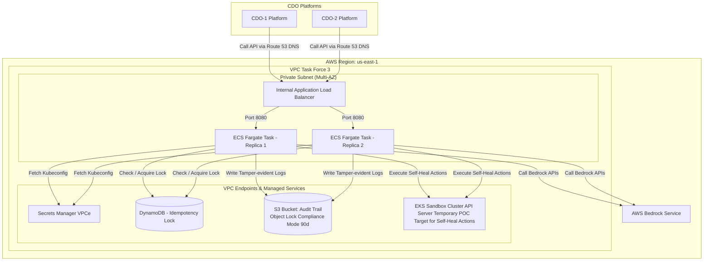

# Deployment Contract - Task Force 3 (Self-Heal Engine)

## 1. Mục đích

Tài liệu này xác định **quy chuẩn triển khai hạ tầng (Deployment Specification)** của AI Engine và các phân quyền Kubernetes đi kèm để thực thi các hành động khắc phục lỗi. Các phân quyền và hạ tầng được thiết kế tương thích với các ứng dụng microservice có trong **RE2 và RE3 dataset** (Online Boutique) và phục vụ multi-tenant cho hai nền tảng CDO.

---

## 2. Infrastructure Hosting & Offline Testing Strategy

AI Engine được triển khai dưới dạng **shared backend service** chạy trên ECS Fargate tasks độc lập. Nhóm AI chịu trách nhiệm quản lý, build image, task definition, runtime và scale, trong khi các CDO platform tích hợp bằng cách gọi vào endpoint nội bộ được cung cấp dưới đây.

### A. Compute Configuration

Bảng dưới đây mô tả các thông số triển khai tối thiểu mà AI team phải cung cấp và duy trì cho AI Engine:

| Aspect | Configuration |
|---|---|
| **Target Compute** | ECS Fargate |
| **Cluster name** | `tf-3-aiops-cluster` |
| **Service name** | `ai-engine` |
| **Task definition family** | `tf-3-ai-engine` |
| **Container name** | `ai-engine` |
| **Container port** | `8080` |
| **Image source** | ECR repo URI + immutable image tag |
| **CPU per task** | 1024 CPU units (1.0 vCPU) |
| **Memory per task** | 2048 MB (2.0 GB) |

### B. Per-Tenant Capacity & Scaling Guardrails

Hệ thống hỗ trợ scaling tự động để bảo đảm hiệu năng phục vụ multi-tenant:

| Aspect | Value |
|---|---|
| **Replicas** | Min: 2 tasks, Max: 10 tasks |
| **Autoscale trigger 1** | Target CPU >= 70% |
| **Autoscale trigger 2** | Target request count 100 per task |
| **Scale-up cooldown** | 60 giây |
| **Scale-down cooldown** | 300 giây |

### C. CDO Platform Integration & Routing

AI Engine chạy một instance duy nhất (shared backend) cho cả hai CDO platform thuộc Task Force 3:

| CDO platform | Tenant ID | Endpoint URL | Auth |
|---|---|---|---|
| **CDO-1** | `cdo-1` | `https://ai-engine.tf-3.internal/` | IAM SigV4 |
| **CDO-2** | `cdo-2` | `https://ai-engine.tf-3.internal/` | IAM SigV4 |
| **Simulation (RE2)** | `tnt-re2-simulation` | (Internal simulation routing) | IAM SigV4 / Local |
| **Simulation (RE3)** | `tnt-re3-simulation` | (Internal simulation routing) | IAM SigV4 / Local |


### D. Chiến lược chạy thử nghiệm mô phỏng (Offline Simulation Mode)
* Vì RE2 và RE3 dataset là dữ liệu offline đã thu thập dưới dạng CSV tĩnh, các hành động sửa đổi hạ tầng thật (`RESTART_DEPLOYMENT`, `SCALE_UP_PODS`,...) sẽ được **chạy ở chế độ giả lập (Mock Mode)** trong môi trường sandbox của CDO.
* CDO Platform sẽ ghi nhận lệnh gọi từ AI Engine, ghi log kiểm toán tương ứng, và mô phỏng phản hồi thành công. Dữ liệu telemetry phản hồi tiếp theo sẽ được trích xuất từ dữ liệu tĩnh lịch sử (sau mốc thời gian lỗi của dataset) để gửi verify.

---

## 3. ECS IAM Roles & Secrets Management

Để bảo đảm an toàn hạ tầng và tuân thủ các nguyên tắc đặc quyền tối thiểu (Least Privilege), phân quyền IAM được chia tách rõ ràng giữa giai đoạn khởi tạo (Execution) và giai đoạn chạy (Task).

### A. Phân tách IAM Roles
1. **ECS Task Execution Role**: Được sử dụng bởi ECS Agent để pull image từ ECR, đẩy logs lên CloudWatch Logs và lấy các secret từ Secrets Manager khi khởi tạo container.
2. **ECS Task Role**: Được sử dụng trực tiếp bởi ứng dụng AI Engine tại runtime để gọi các dịch vụ AWS Bedrock, DynamoDB, S3 và EKS API.

### B. AWS Secrets Manager Path Conventions
Tất cả các secret liên quan đến AI Engine phải được lưu trữ theo quy chuẩn đường dẫn sau:
* Base path: `tf-3/ai-engine/*`
* API Key cho Bedrock: `tf-3/ai-engine/bedrock`
* Kubeconfig cho Sandbox EKS Cluster: `tf-3/ai-engine/kubeconfig`

*Lưu ý*: Nghiêm cấm hardcode thông tin xác thực (Access Key/Secret Key) trong code hoặc Task Definition. Mọi credential rotate tự động thông qua Secrets Manager rotation policy.

### C. Task Execution Role IAM Policy
```json
{
  "Version": "2012-10-17",
  "Statement": [
    {
      "Effect": "Allow",
      "Action": [
        "ecr:GetAuthorizationToken",
        "ecr:BatchCheckLayerAvailability",
        "ecr:GetDownloadUrlForLayer",
        "ecr:BatchGetImage"
      ],
      "Resource": "*"
    },
    {
      "Effect": "Allow",
      "Action": [
        "logs:CreateLogStream",
        "logs:PutLogEvents"
      ],
      "Resource": "arn:aws:logs:us-east-1:*:log-group:/aws/ecs/tf-3-ai-engine:*"
    },
    {
      "Effect": "Allow",
      "Action": [
        "secretsmanager:GetSecretValue"
      ],
      "Resource": "arn:aws:secretsmanager:us-east-1:*:secret:tf-3/ai-engine/*"
    }
  ]
}
```

### D. Task Role IAM Policy (Runtime)
```json
{
  "Version": "2012-10-17",
  "Statement": [
    {
      "Sid": "DynamoDBIdempotencyLock",
      "Effect": "Allow",
      "Action": [
        "dynamodb:GetItem",
        "dynamodb:PutItem",
        "dynamodb:UpdateItem"
      ],
      "Resource": "arn:aws:dynamodb:us-east-1:*:table/tf-3-aiops-idempotency-lock"
    },
    {
      "Sid": "S3AuditTrailWrite",
      "Effect": "Allow",
      "Action": [
        "s3:PutObject",
        "s3:GetObject"
      ],
      "Resource": "arn:aws:s3:::tf-3-aiops-audit-trail/*"
    },
    {
      "Sid": "BedrockInvokeModel",
      "Effect": "Allow",
      "Action": [
        "bedrock:InvokeModel",
        "bedrock:InvokeModelWithResponseStream"
      ],
      "Resource": "arn:aws:bedrock:us-east-1::foundation-model/*"
    },
    {
      "Sid": "SecretsManagerFetchKubeconfig",
      "Effect": "Allow",
      "Action": [
        "secretsmanager:GetSecretValue"
      ],
      "Resource": "arn:aws:secretsmanager:us-east-1:*:secret:tf-3/ai-engine/kubeconfig-*"
    }
  ]
}
```

*Điều khoản cấm (Forbidden Actions)*: Task Role tuyệt đối không được cấp quyền `iam:*`, `ec2:*` hoặc các hành động sửa đổi hạ tầng mạng.

---

## 4. Idempotency Lock & Audit Logging (SOC2 Compliance)

### A. Idempotency Lock

#### 1. Tại sao cần Idempotency Lock?
Trong môi trường phân tán hoặc khi xảy ra sự cố mạng, một hệ thống giám sát (CDO) có thể gửi yêu cầu gọi API `/v1/decide` hoặc thực thi hành động nhiều lần do cơ chế tự động thử lại (Retry).
* Nếu không có Idempotency Lock, hạ tầng có thể thực hiện một hành động sửa lỗi **2 lần liên tiếp** (ví dụ: Khởi động lại deployment 2 lần liên tục, hoặc tăng số lượng pod gấp đôi 2 lần), gây mất ổn định nghiêm trọng hơn và lãng phí tài nguyên hạ tầng.

#### 2. Nguyên lý hoạt động
1. Mỗi quyết định hành động tự chữa lành được sinh ra tại `/v1/decide` bắt buộc phải kèm theo một `Idempotency-Key` (UUID v4 duy nhất).
2. Khi bắt đầu thực thi hành động, CDO Platform sẽ kiểm tra khóa này trong cơ sở dữ liệu khóa (Lock database).
3. Nếu khóa **chưa tồn tại**: Hệ thống sẽ ghi nhận khóa và tiến hành thực thi hành động.
4. Nếu khóa **đã tồn tại** (đang chạy hoặc đã hoàn thành gần đây): Hệ thống sẽ từ chối và trả về mã lỗi **`409 Conflict`** cho các yêu cầu trùng lặp, bảo đảm hành động chỉ được thực hiện duy nhất 1 lần.

- Mọi action plan được quyết định tại `/v1/decide` phải có `Idempotency-Key`.
- Nhóm CDO platform sử dụng **DynamoDB với Conditional Writes** (hoặc **Redis lock** với TTL = 5 phút) để khóa trùng lặp lệnh. Nếu một action đang chạy, mọi request trùng `Idempotency-Key` sẽ bị từ chối với mã lỗi `409 Conflict`.

### B. Tamper-Evident Audit Logging
- Mọi chu kỳ xử lý (Detect -> Decide -> Execute -> Verify) bắt buộc phải được ghi nhật ký hoạt động đầy đủ.
- **Hạ tầng lưu trữ**: Sử dụng **Amazon S3** được cấu hình chế độ **Object Lock** (WORM - Write Once, Read Many) ở chế độ **Compliance mode** với thời gian giữ tối thiểu **90 ngày**.
- CDO platform chịu trách nhiệm cung cấp giao diện truy vấn nhật ký kiểm toán (thông qua Amazon Athena hoặc UI quản trị).

---

## 5. Networking & Security Groups

AI Engine được triển khai hoàn toàn trong mạng nội bộ bảo mật, không tiếp xúc trực tiếp với Internet công cộng.

### A. Network Architecture
- **Subnet type**: Private Subnet (Multi-AZ).
- **Public IP**: Vô hiệu hóa hoàn toàn (`assign_public_ip = false`).
- **Load Balancer**: Sử dụng Internal Application Load Balancer (Internal ALB) định tuyến trên port 8080.
- **DNS**: Truy cập nội bộ qua Route 53 Private Hosted Zone với tên miền: `https://ai-engine.tf-3.internal/`.

### B. Security Group Rules (`tf-3-ai-engine-sg`)

#### Ingress (Inbound) Rules

| Source | Protocol | Port Range | Description |
|---|---|---|---|
| CDO-1 Platform Security Group | TCP | `8080` | Cho phép CDO-1 Platform gửi request API (`v1/detect`, `v1/decide`, `v1/verify`) |
| CDO-2 Platform Security Group | TCP | `8080` | Cho phép CDO-2 Platform gửi request API (`v1/detect`, `v1/decide`, `v1/verify`) |
| Mọi nguồn khác (Anywhere) | All | All | Chặn hoàn toàn (Deny by default) |

#### Egress (Outbound) Rules

| Destination | Protocol | Port Range | Description |
|---|---|---|---|
| AWS Secrets Manager VPC Endpoint | TCP | `443` | Kết nối lấy secrets, credentials, và kubeconfig cấu hình |
| AWS Bedrock Endpoint | TCP | `443` | Gọi APIs của AWS Bedrock phục vụ phân tích log/context |
| Amazon DynamoDB VPC Endpoint | TCP | `443` | Kiểm tra và cập nhật khóa chống trùng lặp (Idempotency Lock) |
| Amazon S3 VPC Endpoint | TCP | `443` | Ghi nhật ký kiểm toán (Audit Trail) phục vụ tuân thủ SOC2 |
| EKS Sandbox Cluster API Server | TCP | `443` / `6443` | Thực thi các hành động chữa lành (Self-Heal Actions) trên EKS cluster |


### C. Deployment Topology Diagram



---

## 6. Rollback & Canary Rollout

### A. Rollout Strategy (Canary)
- **Bước 1**: Điều hướng 10% lưu lượng sang phiên bản AI Engine mới. Giữ trong 5 phút để theo dõi.
- **Bước 2**: Tăng lên 50% lưu lượng. Giữ trong 5 phút để theo dõi.
- **Bước 3**: Hoàn tất 100% lưu lượng nếu không phát hiện bất thường.

### B. Tiêu chuẩn dừng khẩn cấp (Abort Criteria)
Hệ thống giám sát Canary của CDO sẽ tự động dừng rollout và kích hoạt rollback ngay lập tức nếu phát hiện bất kỳ tiêu chí nào sau đây:
- Tỷ lệ lỗi API của AI Engine (`5xx` error rate) vượt quá `1.0%`.
- Độ trễ phản hồi p99 của AI Engine vượt quá `800 ms`.
- Kiểm tra sức khỏe (Health Check) thất bại liên tiếp quá ngưỡng quy định.

### C. Cơ chế Rollback
- **Phương thức chính**: ArgoCD tự động rollback trạng thái Kubernetes sang Git commit SHA ổn định trước đó.
- **Phương thức dự phòng**: ECS Service rollback thủ công sang task definition version trước đó.
- **Mục tiêu RTO (Recovery Time Objective)**: `< 60 giây` từ thời điểm kích hoạt.

---

## 7. Health Check & Readiness Endpoints

AI Engine phải cung cấp các HTTP endpoints sau trên container port `8080` để phục vụ công tác giám sát trạng thái và định tuyến của ALB:

### A. Health Check Endpoint (`GET /health`)
- **Mục đích**: Kiểm tra trạng thái sống (Liveness) của container. Chỉ chạy các kiểm tra nhanh nội bộ (cpu/memory/process).
- **Response**: HTTP 200 OK
- **Example Payload**:
  ```json
  {
    "status": "healthy",
    "timestamp": "2026-06-25T10:00:00Z"
  }
  ```

### B. Readiness Check Endpoint (`GET /ready`)
- **Mục đích**: Xác nhận AI Engine đã sẵn sàng tiếp nhận traffic. Kiểm tra các kết nối hạ nguồn (S3, DynamoDB, Bedrock, Secrets Manager).
- **Response**: HTTP 200 OK (nếu tất cả kết nối tốt) hoặc HTTP 503 Service Unavailable (nếu có kết nối lỗi).
- **Example Payload**:
  ```json
  {
    "status": "ready",
    "dependencies": {
      "bedrock": "connected",
      "dynamodb_lock": "connected",
      "s3_audit_trail": "connected"
    }
  }
  ```

### C. Metrics Endpoint (`GET /metrics`)
- **Mục đích**: Cung cấp các thông số giám sát định dạng Prometheus để CDO Collector thu thập.
- **Exposed metrics**: Lượt requests, độ trễ API, lỗi hệ thống, CPU/Memory usage.

### D. ALB Health Check Parameters
* **Port**: 8080
* **Interval**: 30 giây
* **Healthy threshold**: 2 lần kiểm tra liên tiếp thành công (HTTP 200)
* **Unhealthy threshold**: 3 lần kiểm tra liên tiếp thất bại (non-200)

---

## 8. Failure Modes & Response & Observability

### A. Observability
- **OTel Endpoint**: Cấu hình URL của OTel Collector tương ứng với từng CDO platform thông qua environment variables.
- **Logs**: Đẩy logs tập trung về Amazon CloudWatch Logs (retention policy 14 ngày).
- **Metrics**: Cung cấp Prometheus endpoints phục vụ thu thập chủ động (pull-based).
- **Traces**: Định dạng OpenTelemetry đẩy về Jaeger hoặc AWS X-Ray.

### B. Failure Modes & Response Action Table

| Failure Mode | Detection | Response |
|---|---|---|
| **Task crash / Out of Memory** | ECS Container Health Check | ECS Agent tự động khởi động lại Task |
| **Bedrock API Throttling (429)** | Lỗi trả về từ SDK Bedrock | Áp dụng Exponential Backoff + chuyển sang Fallback Rule-Based (chế độ dự phòng không LLM) |
| **Rò rỉ bộ nhớ (Memory Leak)** | Sử dụng bộ nhớ task vượt > 90% | Kích hoạt cơ chế Rolling Restart các tasks một cách tuần tự |
| **Mất kết nối DynamoDB/S3** | Alert từ `/ready` endpoint | Ngắt traffic ALB sang task lỗi, kích hoạt luồng fallback của CDO Platform sang static runbook |