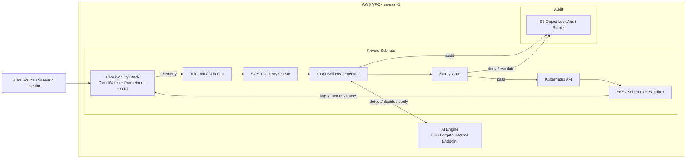

# Infrastructure Design - Task Force 3 Self-Heal Engine - CDO-02

**Doc owner:** CDO-02  
**Trạng thái:** Ready for W11 Pack #1 review  
**Cập nhật lần cuối:** 2026-06-23  

## 1. Mục tiêu kiến trúc

CDO-02 thiết kế platform để Self-Heal Engine chạy an toàn trên Kubernetes/EKS. AI team cung cấp decision service qua các endpoint `/v1/detect`, `/v1/decide`, `/v1/verify`; CDO-02 chịu trách nhiệm thu thập telemetry, gọi AI, kiểm tra safety, execute action, verify, rollback/escalate và ghi audit.

Angle của CDO-02 là **K8s-heavy / Kubernetes Workflow Orchestration**. Trọng tâm không phải chỉ deploy AI, mà là xây lớp orchestration kiểm soát mọi hành động tự chữa lỗi trên Kubernetes.

## 2. Đọc nhanh: hệ thống này chạy như thế nào?

Nói ngắn gọn, CDO-02 xây một "người điều phối" nằm giữa alert, AI và Kubernetes:

```text
Alert xảy ra
-> CDO gom logs/metrics/traces
-> CDO hỏi AI: "đây là lỗi gì?"
-> CDO hỏi AI: "nên làm action gì?"
-> CDO kiểm tra action đó có an toàn không
-> Nếu an toàn thì CDO execute trên Kubernetes
-> CDO verify lại kết quả
-> CDO ghi audit
```

Điểm quan trọng: **AI không tự ý sửa Kubernetes**. AI chỉ trả `action_plan`; CDO executor mới là nơi quyết định có được execute hay không sau khi qua safety gate.

### 2.1 Các thành phần chính, hiểu đơn giản

| Thành phần | Hiểu đơn giản là gì? | Ai phụ trách? |
|---|---|---|
| Alert Source / Scenario Injector | Nơi tạo sự cố giả hoặc alert thật | CDO |
| Telemetry Collector | Bộ gom logs, metrics, traces để gửi AI | CDO |
| AI Engine | Bộ não phân tích lỗi và đề xuất action | AI team |
| CDO Self-Heal Executor | Bộ điều phối workflow self-heal | CDO |
| Safety Gate | Chốt chặn an toàn trước khi execute | CDO |
| Kubernetes API | Nơi CDO thực hiện restart/scale/patch | CDO dùng |
| Audit Storage | Nơi ghi lại toàn bộ quá trình xử lý | CDO |

### 2.2 Vì sao không cho AI execute trực tiếp?

Nếu AI gọi Kubernetes trực tiếp, CDO khó đảm bảo:

- AI có thao tác đúng namespace không.
- AI có vượt blast-radius không.
- Action có rollback/verify plan không.
- Có audit đầy đủ trước và sau action không.

Vì vậy CDO-02 chọn boundary:

```text
AI = decide
CDO = validate + execute + verify + audit
```

## 3. Architecture Diagram



Caption: CDO executor là điểm điều phối chính. AI chỉ đưa ra decision/action plan theo contract. CDO executor enforce safety gate, gọi Kubernetes API khi action được phép, sau đó verify và ghi audit.

## 4. Component Table

| Component | Service/Technology | Vai trò | Ghi chú |
|---|---|---|---|
| Kubernetes sandbox | EKS/Kubernetes | Chạy sample workloads và namespaces tenant | Target chính của self-heal |
| CDO Self-Heal Executor | Pod/Deployment trong EKS | Điều phối detect -> decide -> safety -> execute -> verify | CDO own |
| Telemetry Collector | CloudWatch/Container Insights/Prometheus/OpenTelemetry | Thu logs, metrics, traces theo contract AI | CDO chuẩn hóa data trước khi gọi AI |
| Telemetry Queue | Amazon SQS | Buffer telemetry đã chuẩn hóa từ RE2/RE3 preprocessor hoặc runtime collector | Khớp emit point trong telemetry contract AI |
| AI Engine | ECS Fargate internal endpoint | Decision service do AI team own | Endpoint `https://ai-engine.tf-3.internal/` |
| Safety Gate | Module trong executor | Validate tenant, namespace, confidence, blast-radius, rollback, verify | Chặn unsafe action |
| Idempotency Lock | DynamoDB conditional write | Chống execute trùng cùng `Idempotency-Key` | Khớp deployment contract AI |
| Audit Storage | S3 Object Lock | Ghi audit tamper-evident, retention >=90 ngày | Theo contract AI |
| Logs | CloudWatch Logs | Logs executor, AI request/response, safety decision | Query theo `correlation_id` |
| Metrics | Prometheus-compatible / CloudWatch Metrics | Error rate, latency, memory, restart count | Dùng cho detect/verify |
| Traces | OpenTelemetry -> X-Ray/Jaeger | Trace lỗi liên service | Theo contract AI, triển khai W12 nếu kịp |

## 5. Main Workflow

```text
1. Alert source hoặc scenario injector tạo incident.
2. Telemetry collector/preprocessor gom metrics/logs/traces theo telemetry contract.
3. Với RE2/RE3 Offline Simulation Mode, preprocessor đọc `metrics.csv`, `logs.csv`, `traces.csv`, inject `tenant_id`, chuẩn hóa signal và emit qua SQS.
4. CDO executor gọi AI /v1/detect.
5. Nếu AI phát hiện anomaly, executor gọi /v1/decide.
6. AI trả action_plan[].
7. Safety gate validate tenant, namespace, blast-radius, rollback plan, verify plan.
8. Nếu pass, executor chạy dry-run hoặc mock execute theo Offline Simulation Mode.
9. Executor ghi nhận action result.
10. Executor thu post-action telemetry hoặc đọc post_telemetry_window từ dataset.
11. Executor gọi AI /v1/verify.
12. Nếu success, close incident và ghi audit.
13. Nếu regression/fail, rollback hoặc escalate với context bundle.
```

## 6. AI Contract Integration

CDO-02 consume AI API Contract như sau:

| API | CDO usage |
|---|---|
| `POST /v1/detect` | Gửi telemetry/context để AI xác định anomaly |
| `POST /v1/decide` | Nhận `action_plan[]`, `blast_radius_config`, confidence |
| `POST /v1/verify` | Gửi post-action metrics để AI xác định success/regression |

Headers/auth theo contract:

```text
Authorization: IAM SigV4
X-Tenant-Id: cdo-2
Idempotency-Key: UUID v4
X-Correlation-Id: incident correlation id
```

Các action CDO sẽ hỗ trợ theo allow-list:

```text
RESTART_DEPLOYMENT
SCALE_UP_PODS
UPDATE_ENV_SECRET
ADJUST_MEMORY_LIMIT
```

W11 Pack #1 chỉ chốt design và contract alignment. Theo AI API Contract, RE2/RE3 Offline Simulation Mode chạy ở dạng **Mock Mode**: CDO ghi nhận action giả định đã thực hiện, rồi gửi `post_telemetry_window` từ dataset sang `/v1/verify`. Nếu trainer yêu cầu, CDO-02 sẽ bổ sung demo action thật trên Kubernetes sandbox ở W12.

## 7. Multi-Tenant Approach

CDO-02 dùng namespace-based tenant isolation:

```text
tenant-a namespace
tenant-b namespace
platform namespace
```

Nguyên tắc:

- Mọi request phải có `tenant_id`.
- Mọi Kubernetes target phải nằm trong namespace tương ứng tenant.
- Executor không được thao tác cross-namespace nếu action plan không khớp tenant.
- ServiceAccount/RoleBinding tách theo namespace.
- Audit log ghi `tenant_id`, namespace, action, result, correlation_id.

### 7.1 Tenant Onboarding Flow

Trong capstone, CDO-02 chỉ cần tối thiểu 2 tenants để chứng minh isolation. Tenant onboarding dự kiến:

```text
1. Tạo namespace tenant mới.
2. Tạo Role/RoleBinding giới hạn trong namespace đó.
3. Deploy sample workload cho tenant.
4. Gắn labels/annotations: tenant_id, service, environment.
5. Chạy smoke test: alert -> AI -> safety gate -> deny/execute đúng namespace.
```

### 7.2 Noisy Neighbor Mitigation

- Giới hạn action theo tenant namespace.
- Không cho một incident scale/restart nhiều deployment cùng lúc nếu vượt blast-radius.
- Rate limit request theo `X-Tenant-Id` theo AI API contract.
- Audit mọi action bị deny do cross-tenant hoặc vượt blast-radius.

## 8. Safety Gate

Safety gate là lớp kiểm tra trước khi CDO thực hiện bất kỳ action nào trên Kubernetes. Có thể hiểu đây là "bộ phanh an toàn" của hệ thống self-heal.

Ví dụ: nếu AI trả về "restart deployment tenant-b/api-service" nhưng incident đang thuộc `tenant-a`, safety gate phải chặn ngay và ghi audit.

Safety gate bắt buộc kiểm tra:

| Check | Rule |
|---|---|
| Tenant match | `tenant_id` phải khớp namespace target |
| Action allow-list | Chỉ cho phép action đã định nghĩa trong AI contract |
| Blast-radius | Không vượt số deployment/replica giới hạn |
| Rollback plan | Bắt buộc có với action mutate |
| Verify plan | Bắt buộc có metric/log để verify sau action |
| Idempotency | Không execute trùng cùng `Idempotency-Key`; ưu tiên DynamoDB conditional write |
| AI confidence | Ngưỡng execute cần chốt với AI |
| Failure fallback | AI 503/timeout -> escalate + audit, không execute mặc định |

## 9. Observability Design

Observability là phần giúp AI và CDO hiểu chuyện gì đang xảy ra trong hệ thống. Với TF3, CDO ưu tiên thu thập 3 loại dữ liệu:

- **Metrics:** số liệu như latency, error rate, memory usage.
- **Logs:** log lỗi từ application.
- **Traces:** dấu vết request đi qua nhiều service.

AI cần các dữ liệu này để detect/decide/verify. CDO cần các dữ liệu này để chứng minh action đã xử lý lỗi thật hay chưa.

Telemetry theo contract AI:

| Signal | Source dự kiến |
|---|---|
| `istio_request_error_rate` | Prometheus/Istio metrics hoặc mock metric source |
| `istio_request_latency_p95` | Prometheus histogram / CloudWatch metric |
| `container_memory_working_set_bytes` | Container Insights / Prometheus |
| `app_log_error_event` | CloudWatch Logs parser |
| `trace_span_error_event` | OpenTelemetry/X-Ray/Jaeger |

Với Offline Simulation Mode, nguồn chính là `metrics.csv`, `logs.csv`, `traces.csv` từ RE2/RE3; CDO preprocessor tính toán signal phái sinh, inject `tenant_id` và emit qua SQS. W12 sẽ collect evidence từ simulation dataset, và có thể bổ sung sandbox telemetry nếu trainer yêu cầu action thật.

## 10. Scaling Strategy

Scaling trong Pack #1 được thiết kế ở mức khả thi cho W12 demo, không phải production blueprint.

| Layer | Scaling approach | Trigger |
|---|---|---|
| CDO executor | Kubernetes Deployment replicas | CPU, request count, queue length nếu có |
| Telemetry collector | Scale theo log/metric volume | CloudWatch/Prometheus scrape load |
| Telemetry queue | SQS buffer | Queue depth / age of oldest message |
| AI Engine | Theo deployment contract của AI trên ECS Fargate | CPU, memory, request latency |
| Workload target | Theo AI action plan và safety gate | Queue backlog, latency/error rate |

Nguyên tắc scale:

- Scale action phải nằm trong allow-list và blast-radius.
- Không scale cross-tenant.
- Mọi scale action phải có verify plan.
- Nếu AI confidence thấp hoặc verify signal thiếu, CDO escalate thay vì scale.

## 11. Failure Modes And Recovery

Phần này liệt kê các lỗi có thể xảy ra trong quá trình self-heal và cách CDO xử lý. Mục tiêu là khi có lỗi, hệ thống fail-safe: **không execute bừa**, mà deny/escalate/audit.

| Failure | Detection | Recovery |
|---|---|---|
| AI endpoint timeout/503 | HTTP client timeout/error | Không execute, escalate + audit |
| AI response thiếu rollback/verify plan | Schema validation fail | Deny action, audit reason |
| Cross-tenant target | Safety gate detect namespace mismatch | Deny action, audit `denied_cross_tenant` |
| Kubernetes action fail | kubectl/API error | Rollback nếu safe, nếu không escalate |
| Verify regression | `/v1/verify` trả regression | Rollback/escalate |
| Audit writer fail | S3/CloudWatch write error | Stop execution hoặc mark incident unsafe |

## 12. Alternatives Considered

| Option | Pros | Cons | Decision |
|---|---|---|---|
| Serverless-first | Ít vận hành, cost thấp khi ít traffic | Không sát bài toán Kubernetes self-heal | Rejected |
| Managed-services heavy | Dễ dùng AWS native services | Có thể xa K8s workload, khó chứng minh RBAC namespace | Rejected as main angle |
| Event-driven hybrid | Có retry/queue tốt | Nhiều moving parts cho W11/W12 | Considered as future enhancement |
| K8s-heavy workflow orchestration | Sát TF3, kiểm soát K8s action tốt | Phức tạp và cost cao hơn | Accepted |

## 13. Infra Skeleton For W11

Terraform/manifests skeleton dự kiến:

```text
infra/
  envs/
    dev/
  modules/
    vpc/
    eks/
    observability/
manifests/
  namespaces/
    tenant-a.yaml
    tenant-b.yaml
    platform.yaml
```

Mục tiêu T6 W11 là có skeleton/base IaC rõ ràng và commit evidence. Mức chạy thật của VPC/EKS/observability cần xác nhận với trainer nếu AWS account hoặc quota chưa sẵn sàng.

## 14. Open Items

- Cần AI confirm boundary: AI chỉ trả `action_plan` hay AI cũng execute Kubernetes action.
- Cần trainer confirm T6 yêu cầu infra chạy thật tới mức nào.
- Offline Simulation Mode đã là Mock Mode theo contract AI; cần trainer confirm có cần bổ sung action thật trên sandbox không.
- Cần chốt confidence threshold để CDO được execute action.

## Related Documents

- `01_requirements_analysis.md`
- `03_security_design.md`
- `08_adrs.md`
