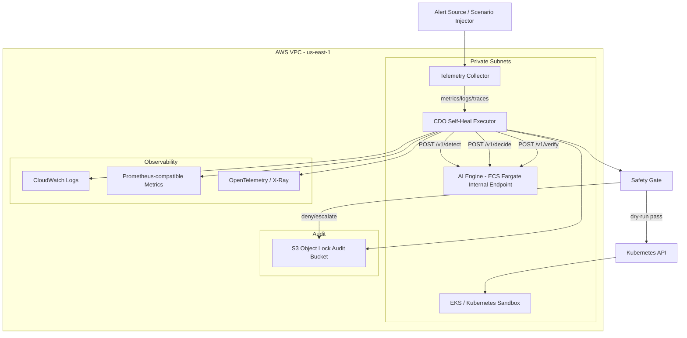

# Infrastructure Design - Task Force 3 Self-Heal Engine - CDO-02

**Doc owner:** CDO-02  
**Trạng thái:** Ready for W11 Pack #1 review  
**Cập nhật lần cuối:** 2026-06-23  

## 1. Mục tiêu kiến trúc

CDO-02 thiết kế platform để Self-Heal Engine chạy an toàn trên Kubernetes/EKS. AI team cung cấp decision service qua các endpoint `/v1/detect`, `/v1/decide`, `/v1/verify`; CDO-02 chịu trách nhiệm thu thập telemetry, gọi AI, kiểm tra safety, execute action, verify, rollback/escalate và ghi audit.

Angle của CDO-02 là **K8s-heavy / Kubernetes Workflow Orchestration**. Trọng tâm không phải chỉ deploy AI, mà là xây lớp orchestration kiểm soát mọi hành động tự chữa lỗi trên Kubernetes.

## 2. Architecture Diagram



Caption: CDO executor là điểm điều phối chính. AI chỉ đưa ra decision/action plan theo contract. CDO executor enforce safety gate, gọi Kubernetes API khi action được phép, sau đó verify và ghi audit.

## 3. Component Table

| Component | Service/Technology | Vai trò | Ghi chú |
|---|---|---|---|
| Kubernetes sandbox | EKS/Kubernetes | Chạy sample workloads và namespaces tenant | Target chính của self-heal |
| CDO Self-Heal Executor | Pod/Deployment trong EKS | Điều phối detect -> decide -> safety -> execute -> verify | CDO own |
| Telemetry Collector | CloudWatch/Container Insights/Prometheus/OpenTelemetry | Thu logs, metrics, traces theo contract AI | CDO chuẩn hóa data trước khi gọi AI |
| AI Engine | ECS Fargate internal endpoint | Decision service do AI team own | Endpoint `https://ai-engine.tf-3.internal/` |
| Safety Gate | Module trong executor | Validate tenant, namespace, confidence, blast-radius, rollback, verify | Chặn unsafe action |
| Audit Storage | S3 Object Lock | Ghi audit tamper-evident, retention >=90 ngày | Theo contract AI |
| Logs | CloudWatch Logs | Logs executor, AI request/response, safety decision | Query theo `correlation_id` |
| Metrics | Prometheus-compatible / CloudWatch Metrics | Error rate, latency, memory, restart count | Dùng cho detect/verify |
| Traces | OpenTelemetry -> X-Ray/Jaeger | Trace lỗi liên service | Theo contract AI, triển khai W12 nếu kịp |

## 4. Main Workflow

```text
1. Alert source hoặc scenario injector tạo incident.
2. Telemetry collector gom metrics/logs/traces theo telemetry contract.
3. CDO executor gọi AI /v1/detect.
4. Nếu AI phát hiện anomaly, executor gọi /v1/decide.
5. AI trả action_plan[].
6. Safety gate validate tenant, namespace, blast-radius, rollback plan, verify plan.
7. Nếu pass, executor chạy dry-run.
8. Nếu dry-run pass, executor execute action trên Kubernetes.
9. Executor thu post-action telemetry.
10. Executor gọi AI /v1/verify.
11. Nếu success, close incident và ghi audit.
12. Nếu regression/fail, rollback hoặc escalate với context bundle.
```

## 5. AI Contract Integration

CDO-02 consume AI API Contract như sau:

| API | CDO usage |
|---|---|
| `POST /v1/detect` | Gửi telemetry/context để AI xác định anomaly |
| `POST /v1/decide` | Nhận `action_plan[]`, `blast_radius_config`, confidence |
| `POST /v1/verify` | Gửi post-action metrics để AI xác định success/regression |

Headers/auth theo contract:

```text
Authorization: IAM SigV4
X-Tenant-Id: cdo-2
Idempotency-Key: UUID v4
X-Correlation-Id: incident correlation id
```

Các action CDO sẽ hỗ trợ theo allow-list:

```text
RESTART_DEPLOYMENT
SCALE_UP_PODS
UPDATE_ENV_SECRET
ADJUST_MEMORY_LIMIT
```

W11 Pack #1 chỉ chốt design và contract alignment. W12 sẽ build executor và test action thật/mock theo mức trainer và AI thống nhất.

## 6. Multi-Tenant Approach

CDO-02 dùng namespace-based tenant isolation:

```text
tenant-a namespace
tenant-b namespace
platform namespace
```

Nguyên tắc:

- Mọi request phải có `tenant_id`.
- Mọi Kubernetes target phải nằm trong namespace tương ứng tenant.
- Executor không được thao tác cross-namespace nếu action plan không khớp tenant.
- ServiceAccount/RoleBinding tách theo namespace.
- Audit log ghi `tenant_id`, namespace, action, result, correlation_id.

### 6.1 Tenant Onboarding Flow

Trong capstone, CDO-02 chỉ cần tối thiểu 2 tenants để chứng minh isolation. Tenant onboarding dự kiến:

```text
1. Tạo namespace tenant mới.
2. Tạo Role/RoleBinding giới hạn trong namespace đó.
3. Deploy sample workload cho tenant.
4. Gắn labels/annotations: tenant_id, service, environment.
5. Chạy smoke test: alert -> AI -> safety gate -> deny/execute đúng namespace.
```

### 6.2 Noisy Neighbor Mitigation

- Giới hạn action theo tenant namespace.
- Không cho một incident scale/restart nhiều deployment cùng lúc nếu vượt blast-radius.
- Rate limit request theo `X-Tenant-Id` theo AI API contract.
- Audit mọi action bị deny do cross-tenant hoặc vượt blast-radius.

## 7. Safety Gate

Safety gate bắt buộc kiểm tra:

| Check | Rule |
|---|---|
| Tenant match | `tenant_id` phải khớp namespace target |
| Action allow-list | Chỉ cho phép action đã định nghĩa trong AI contract |
| Blast-radius | Không vượt số deployment/replica giới hạn |
| Rollback plan | Bắt buộc có với action mutate |
| Verify plan | Bắt buộc có metric/log để verify sau action |
| Idempotency | Không execute trùng cùng `Idempotency-Key` |
| AI confidence | Ngưỡng execute cần chốt với AI |
| Failure fallback | AI 503/timeout -> escalate + audit, không execute mặc định |

## 8. Observability Design

Telemetry theo contract AI:

| Signal | Source dự kiến |
|---|---|
| `istio_request_error_rate` | Prometheus/Istio metrics hoặc mock metric source |
| `istio_request_latency_p95` | Prometheus histogram / CloudWatch metric |
| `container_memory_working_set_bytes` | Container Insights / Prometheus |
| `app_log_error_event` | CloudWatch Logs parser |
| `trace_span_error_event` | OpenTelemetry/X-Ray/Jaeger |

W11 Pack #1 sẽ mô tả schema và data source. W12 sẽ collect evidence thật từ sandbox hoặc simulation dataset RE2/RE3 tùy AI/trainer xác nhận.

## 9. Scaling Strategy

Scaling trong Pack #1 được thiết kế ở mức khả thi cho W12 demo, không phải production blueprint.

| Layer | Scaling approach | Trigger |
|---|---|---|
| CDO executor | Kubernetes Deployment replicas | CPU, request count, queue length nếu có |
| Telemetry collector | Scale theo log/metric volume | CloudWatch/Prometheus scrape load |
| AI Engine | Theo deployment contract của AI trên ECS Fargate | CPU, memory, request latency |
| Workload target | Theo AI action plan và safety gate | Queue backlog, latency/error rate |

Nguyên tắc scale:

- Scale action phải nằm trong allow-list và blast-radius.
- Không scale cross-tenant.
- Mọi scale action phải có verify plan.
- Nếu AI confidence thấp hoặc verify signal thiếu, CDO escalate thay vì scale.

## 10. Failure Modes And Recovery

| Failure | Detection | Recovery |
|---|---|---|
| AI endpoint timeout/503 | HTTP client timeout/error | Không execute, escalate + audit |
| AI response thiếu rollback/verify plan | Schema validation fail | Deny action, audit reason |
| Cross-tenant target | Safety gate detect namespace mismatch | Deny action, audit `denied_cross_tenant` |
| Kubernetes action fail | kubectl/API error | Rollback nếu safe, nếu không escalate |
| Verify regression | `/v1/verify` trả regression | Rollback/escalate |
| Audit writer fail | S3/CloudWatch write error | Stop execution hoặc mark incident unsafe |

## 11. Alternatives Considered

| Option | Pros | Cons | Decision |
|---|---|---|---|
| Serverless-first | Ít vận hành, cost thấp khi ít traffic | Không sát bài toán Kubernetes self-heal | Rejected |
| Managed-services heavy | Dễ dùng AWS native services | Có thể xa K8s workload, khó chứng minh RBAC namespace | Rejected as main angle |
| Event-driven hybrid | Có retry/queue tốt | Nhiều moving parts cho W11/W12 | Considered as future enhancement |
| K8s-heavy workflow orchestration | Sát TF3, kiểm soát K8s action tốt | Phức tạp và cost cao hơn | Accepted |

## 12. Infra Skeleton For W11

Terraform/manifests skeleton dự kiến:

```text
infra/
  envs/
    dev/
  modules/
    vpc/
    eks/
    observability/
manifests/
  namespaces/
    tenant-a.yaml
    tenant-b.yaml
    platform.yaml
```

Mục tiêu T6 W11 là có skeleton/base IaC rõ ràng và commit evidence. Mức chạy thật của VPC/EKS/observability cần xác nhận với trainer nếu AWS account hoặc quota chưa sẵn sàng.

## 13. Open Items

- Cần AI confirm boundary: AI chỉ trả `action_plan` hay AI cũng execute Kubernetes action.
- Cần trainer confirm T6 yêu cầu infra chạy thật tới mức nào.
- Cần AI/trainer confirm Offline Simulation Mode là mock execute hay action thật trên sandbox.
- Cần chốt confidence threshold để CDO được execute action.

## Related Documents

- `01_requirements_analysis.md`
- `03_security_design.md`
- `08_adrs.md`
