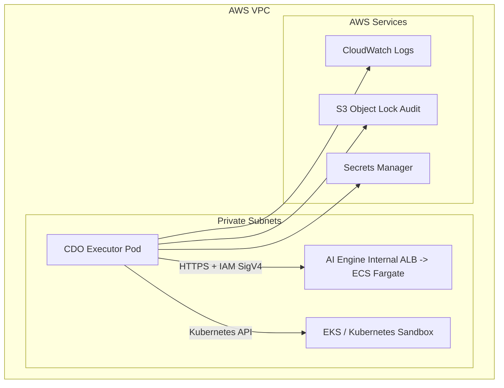

# Security Design - Task Force 3 Self-Heal Engine - CDO-02

**Doc owner:** CDO-02  
**Trạng thái:** Ready for W11 Pack #1 review  
**Cập nhật lần cuối:** 2026-06-23  

## 1. Security Goals

Mục tiêu bảo mật của CDO-02 là cho phép self-heal tự động nhưng không gây unsafe action trên Kubernetes. AI có thể đề xuất action, nhưng mọi thao tác mutate workload phải đi qua CDO safety gate, RBAC, dry-run, rollback/verify và audit.

Security goals chính:

- Zero unsafe action trong sandbox.
- Multi-tenant isolation giữa ít nhất 2 tenants.
- Least privilege cho Kubernetes RBAC và AWS IAM.
- Audit log tamper-evident, retention tối thiểu 90 ngày.
- Không để secret/kubeconfig lộ trong repo, log hoặc container image.
- Ghi đủ evidence để trace một incident theo `correlation_id`.

## 2. Network Security

### 2.1 Network Layout



### 2.2 Network Rules

- AI endpoint là internal endpoint, không public Internet.
- CDO executor gọi AI qua HTTPS và IAM SigV4.
- Kubernetes API access chỉ dành cho executor ServiceAccount/Role phù hợp.
- Audit/log traffic đi tới CloudWatch và S3.
- Nếu cần NAT/VPC endpoints, ưu tiên VPC endpoints cho S3, CloudWatch, Secrets Manager để giảm public exposure.

## 3. IAM And Authentication

| Identity | Used by | Permissions |
|---|---|---|
| CDO executor AWS role | Executor pod/task | Gọi AI endpoint với IAM SigV4, ghi audit S3, ghi logs |
| AI service role | AI ECS Fargate | Theo deployment contract của AI |
| Deploy role | Terraform/CI | Tạo VPC/EKS/IAM/S3/observability theo scope |
| Readonly reviewer role | Mentor/trainer review | Read-only logs, audit, infra describe |

CDO-02 cần làm rõ với AI một điểm quan trọng: deployment contract AI có nhắc AI có thể fetch kubeconfig/gọi EKS API. Nếu CDO-02 giữ boundary "AI only decide, CDO executor execute", thì AI role không nên có quyền mutate Kubernetes.

## 4. Kubernetes RBAC

CDO-02 dùng namespace-based RBAC:

| Namespace | Purpose |
|---|---|
| `platform` | Chạy CDO executor, telemetry collector |
| `tenant-a` | Workload tenant A |
| `tenant-b` | Workload tenant B |

RBAC principles:

- Executor không dùng `cluster-admin`.
- Role theo namespace chỉ cho phép verbs cần thiết.
- Mutating verbs chỉ cấp cho resource cần demo: `deployments`, `pods`, `replicasets` nếu cần.
- Không cấp quyền delete namespace, modify IAM, modify cluster-wide resource.
- Cross-namespace action phải bị deny bởi safety gate và RBAC.

Ví dụ quyền tối thiểu dự kiến:

```text
get/list/watch: pods, deployments, replicasets, events
patch/update: deployments scale/restart target
create: events hoặc configmap audit marker nếu cần
```

## 5. Tenant Isolation

Tenant isolation được enforce ở 3 lớp:

1. **Request layer:** mọi request có `X-Tenant-Id` hoặc `tenant_id`.
2. **Safety layer:** action target namespace phải khớp tenant.
3. **Kubernetes layer:** ServiceAccount/RoleBinding chỉ có quyền trong namespace được phép.

Nếu AI trả action target `tenant-b` cho incident của `tenant-a`, CDO executor phải:

```text
deny action -> không gọi Kubernetes API -> ghi audit denied_cross_tenant -> escalate nếu cần
```

## 6. Secrets Management

Secrets dự kiến:

| Secret | Storage | Accessed by |
|---|---|---|
| AI endpoint auth/IAM config | IAM/IRSA hoặc AWS SDK default chain | CDO executor |
| Webhook signing key | AWS Secrets Manager hoặc K8s Secret | Alert ingestor |
| Kube access | Kubernetes ServiceAccount token | CDO executor |
| Audit bucket config | Terraform variables/outputs | Executor/deploy pipeline |

Controls:

- Không commit secret vào Git.
- Không log bearer token, SigV4 headers đầy đủ hoặc kube token.
- Redact PII và credential-like strings trong logs.
- Ưu tiên IRSA thay vì static AWS keys trong pod.

## 7. Audit Logging

Audit là hard requirement của TF3. CDO-02 thiết kế audit theo `correlation_id` để truy vết toàn bộ incident.

Mỗi incident cần ghi:

```text
alert_received
telemetry_collected
detect_called
detect_response_received
decide_called
action_plan_received
safety_passed / safety_denied
dry_run_done
execute_done
verify_called
verify_done
rollback_done / escalated
```

Audit record tối thiểu:

| Field | Purpose |
|---|---|
| `timestamp` | Thời điểm event |
| `correlation_id` | Trace toàn incident |
| `tenant_id` | Tenant bị ảnh hưởng |
| `namespace` | Namespace target |
| `action_type` | Action AI đề xuất |
| `decision` | execute/deny/escalate |
| `result` | success/failure/denied |
| `reason` | Lý do safety deny hoặc failure |

Storage target theo contract AI: **S3 Object Lock Compliance Mode**, retention tối thiểu 90 ngày.

## 8. Data Protection

- Logs gửi sang AI phải lọc/mã hóa PII nếu có.
- Telemetry payload chỉ nên chứa fields trong telemetry contract.
- Audit log lưu input/output hash nếu payload lớn hoặc nhạy cảm.
- Encryption at rest dùng S3 SSE-KMS nếu có thể.
- Encryption in transit dùng HTTPS/TLS.

## 9. Failure And Abuse Cases

| Case | Control |
|---|---|
| AI trả action ngoài allow-list | Safety gate deny |
| AI trả namespace sai tenant | Safety gate deny + RBAC deny |
| AI timeout/503 | No execute, escalate + audit |
| Idempotency key trùng | Không execute trùng |
| Audit write fail | Stop action hoặc mark incident unsafe |
| Executor bị lỗi giữa action | Verify/rollback/escalate theo trạng thái audit |
| Secret bị lộ trong log | Redaction + không log sensitive headers |

## 10. Open Questions

- AI có thật sự cần kubeconfig/EKS API permission không?
- Nếu AI giữ kubeconfig, boundary RBAC giữa AI và CDO executor là gì?
- Trainer có bắt buộc S3 Object Lock thật cho W11/T6 không, hay W12 mới cần evidence?
- Traces có bắt buộc phải triển khai đầy đủ trong W12 demo không?

## Related Documents

- `01_requirements_analysis.md`
- `02_infra_design.md`
- `08_adrs.md`
